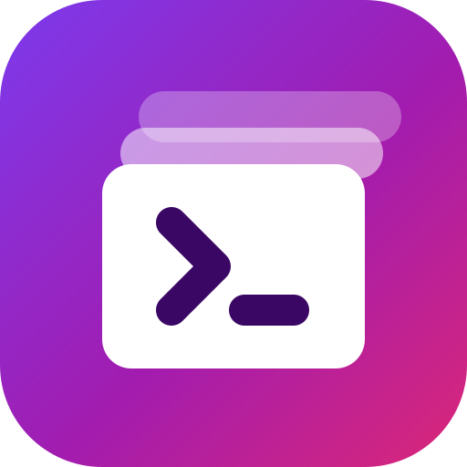

# 🚀 PromptDeck

<p align="center">
  
</p>

<h3 align="center">
The Open Source Platform for Building, Testing, Comparing & Evaluating LLM Prompts
</h3>

<p align="center">
Build once • Compare any model • Evaluate responses • Track costs • Experiment faster
</p>

<p align="center">


</p>

---

## ✨ Overview

**PromptDeck** is an open-source AI engineering platform that lets developers interact with multiple LLM providers through a single interface.

Instead of switching between ChatGPT, Claude, Gemini, Ollama, and a dozen other tools, PromptDeck brings prompt testing, model comparison, evaluation, and cost tracking into one workspace.

> **Status:** Early-stage / actively developed. See [Roadmap](#️-roadmap) for what's shipped vs. planned — the feature list below is marked accordingly.

---

## 🎯 Why PromptDeck?

AI developers currently stitch together multiple disconnected tools:

- ChatGPT / provider consoles for chatting
- OpenRouter for unified APIs
- Promptfoo for evaluations
- LangSmith for tracing
- Postman for API testing
- Spreadsheets for cost tracking
- Notes apps for prompt storage

PromptDeck consolidates these into one platform instead of one more tab.

---

## 🚀 Quickstart

### Prerequisites
- Python 3.11+
- Node.js 18+
- Docker & Docker Compose (recommended)
- At least one provider API key (OpenAI, Gemini, Claude, etc.) or a local Ollama install

### Run with Docker (recommended)

```bash
git clone https://github.com/NotHarshhaa/promptdeck.git
cd promptdeck
cp .env.example .env   # add your API keys
docker compose up --build
```

App: `http://localhost:3000` · API: `http://localhost:8000`

### Run manually

```bash
# Backend
cd apps/api
pip install -r requirements.txt
uvicorn app.main:app --reload

# Frontend (new terminal)
cd apps/web
npm install
npm run dev
```

### Configure

Copy the template, then configure only the providers you intend to use:

```bash
cp .env.example .env
```

```env
# Required only for the matching provider's Live mode
OPENAI_API_KEY=
ANTHROPIC_API_KEY=
GEMINI_API_KEY=
GROQ_API_KEY=

# Required for Live Ollama mode; run Ollama separately
OLLAMA_BASE_URL=http://localhost:11434
```

### Execution modes

- **Demo** — works without credentials and produces a clearly labelled deterministic local response. Use it to explore the playground safely.
- **Live** — becomes available only when the selected provider has its server-side environment value configured. PromptDeck streams the actual response through LiteLLM; API keys are never sent to the browser.

PromptDeck persists conversations, messages, run latency, token counts, and available provider-reported costs in local SQLite (`data/promptdeck.db` by default). The right-hand telemetry panel displays observed values from the latest run, rather than estimates.

---

## ✨ Features

**Shipped (v0.1–v0.3):**
- 🤖 Multi-provider chat (OpenAI, Gemini, Claude, Groq, Ollama, and any OpenAI-compatible API via LiteLLM)
- ⚡ Prompt playground — editor, markdown, syntax highlighting, variables, temperature/token controls
- 🔥 Streaming responses
- 💬 Conversation history — search, filter, tags, favorites
- 🔐 API key management
- 🌙 Dark/light mode, responsive UI
- 🔀 Side-by-side model comparison with stored response, latency, token, and cost data
- 📚 Reusable prompt library with categories, tags, immutable revisions, and rollback
- 💰 Cost analytics per provider/model across playground runs and comparisons
- 📝 Assertion-based response evaluations (contains, absence, exact match, JSON validity, and length)
- 🧪 Reusable batch test suites with per-case assertions, persisted outcomes, and pass-rate gates
- 👍 Human feedback controls for completed prompt runs
- 🛡️ Local-only safety preflight that redacts likely secrets and PII before provider use
- 📤 Conversation exports in Markdown, JSON, CSV, and HTML

**Planned (v0.4+):**
- 📊 Expanded analytics dashboard (usage trends, success/error rate, response-time charts)
- 📈 Advanced automated evaluations — hallucination detection, groundedness, toxicity, and faithfulness
- 📄 PDF reports and batch evaluation exports
- 🔌 LangGraph workflows, MCP support, plugin system

See the full breakdown in [Roadmap](#️-roadmap).

---

## 🏗️ Architecture

```
                        +----------------------+
                        |       Frontend       |
                        |   Next.js + React    |
                        +----------+-----------+
                                   │
                      REST / WebSocket API
                                   │
                    +--------------+--------------+
                    |         FastAPI API         |
                    +--------------+--------------+
                                   │
             +---------------------+----------------------+
             │                                            │
      Authentication                              AI Gateway
             │                                            │
      PostgreSQL / Redis                    LiteLLM / LangChain
             │                                            │
             +---------------------+----------------------+
                                   │
         +-----------+-----------+-----------+-----------+
         │           │           │           │           │
      OpenAI      Gemini      Claude      Ollama    + more via
                                                       LiteLLM
```

---

## 🛠 Tech Stack

| Layer | Tools |
|---|---|
| Frontend | Next.js, React, TypeScript, Tailwind CSS, shadcn/ui, Monaco Editor, TanStack Query, Zustand |
| Backend | FastAPI, Python 3.11+, SQLAlchemy, Pydantic v2, PostgreSQL, Redis |
| AI | LiteLLM, LangChain, LangGraph, Instructor, OpenAI SDK |
| Observability *(planned)* | OpenTelemetry, Langfuse, Prometheus, Grafana, Loki |
| Deployment | Docker, Docker Compose, Kubernetes, GitHub Actions |

---

## 📂 Project Structure

```
promptdeck/
├── apps/
│   ├── api/          # FastAPI backend
│   ├── web/           # Next.js frontend
│   └── docs/
├── packages/
│   ├── sdk/
│   ├── ui/
│   ├── providers/     # Provider adapters
│   ├── prompts/
│   ├── evaluation/
│   └── shared/
├── docker/
├── kubernetes/
├── scripts/
├── examples/
└── .github/
```

---

## 🗺️ Roadmap

| Version | Focus |
|---|---|
| **v0.1** ✅ | Multi-provider chat, streaming, API keys, conversation history |
| **v0.2** ✅ | Model comparison, prompt library, cost tracking |
| **v0.3** ✅ | Prompt versioning, exports, assertion evaluations, analytics, test suites, feedback, safety checks |
| **v0.4** ⬜ | Advanced automated evaluations, benchmarks, reports |
| **v0.5** ⬜ | LangGraph workflows, MCP support, plugins, AI gateway |
| **v1.0** ⬜ | Teams, workspaces, RBAC, audit logs, usage limits |

---

## 🤝 Contributing

Contributions are welcome from developers of all experience levels — bug fixes, new provider integrations, docs, UI improvements, tests, and performance work.

`CONTRIBUTING.md` is on the way; until then, feel free to open an issue or PR directly.

---

## 📜 License

Licensed under the [MIT License](LICENSE).

---

## ❤️ Built For

PromptDeck is built for AI/LLM engineers, platform and MLOps engineers, DevOps engineers, researchers, and anyone building with generative AI who's tired of juggling five different tools to test a prompt.

---

<p align="center">
<strong>⭐ Star the repo if you believe open-source AI engineering tools should be accessible to everyone.</strong>
</p>
